# 175.COMBINE TWO TABLES

```SQL
SELECT FIRSTNAME, LASTNAME, CITY, STATE
FROM ADDRESS A
LEFT JOIN PERSON P ON A.PERSONID = P.PERSONID;
```

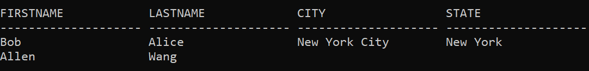

<BR><BR><BR>


# 181.Employees Earning More Than Their Managers

```SQL
SELECT E1.NAME NAME
FROM EMPLOYEE E1
JOIN EMPLOYEE E2 ON E1.MANAGERID = E2.ID
WHERE E1.SALARY > E2.SALARY;
```

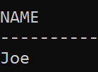

<br><br><br>


# 182. Duplicate Emails

```SQL
SELECT EMAIL
FROM PERSON
GROUP BY EMAIL
HAVING COUNT(*) > 1;
```
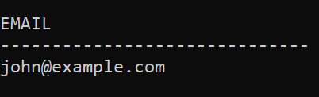

<BR><BR><BR>


# 183. Customers Who Never Order

```SQL
SELECT NAME
FROM CUSTOMERS C
LEFT JOIN ORDERS O ON C.ID = O.CUSTOMERID
WHERE O.CUSTOMERID IS NULL;
```
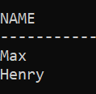

<BR><BR><BR>


# 196. Delete Duplicate Emails

```SQL
DELETE FROM PERSON
WHERE ID NOT IN (SELECT MIN(ID) 
		         FROM PERSON 
		         GROUP BY EMAIL);
```
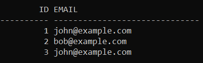

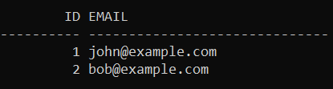

<BR><BR><BR>


# 197. Rising Temperature

```SQL
SELECT T.ID ID
FROM WEATHER Y
JOIN WEATHER T ON Y.RECORDDATE = T.RECORDDATE-1
WHERE Y.TEMPERATURE < T.TEMPERATURE;
```
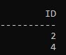

<br><br><br>


# 511. Game Play Analysis I

```sql
SELECT PLAYER_ID, MIN(EVENT_DATE) FIRST_LOGIN
FROM ACTIVITY
GROUP BY PLAYER_ID
```
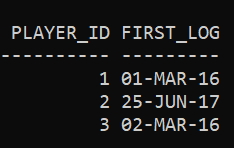

<BR><BR><BR>


# 512 - Game Play Analysis II

```SQL
SELECT A.PLAYER_ID PLAYER_ID, A.DEVICE_ID DEVICE_ID
FROM ACTIVITY A
JOIN (SELECT PLAYER_ID, MIN(EVENT_DATE) EVENTDATE
	  FROM ACTIVITY
	  GROUP BY PLAYER_ID) FL 
ON A.PLAYER_ID = FL.PLAYER_ID AND
	   A.EVENT_DATE = FL.EVENTDATE;
```
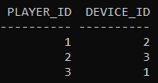

<BR><BR><BR>


# 577 - Employee Bonus

```SQL
SELECT NAME, BONUS
FROM EMPLOYEE E
LEFT JOIN BONUS B ON E.EMPID = B.EMPID
WHERE B.BONUS < 1000 OR
      B.BONUS IS NULL;
```
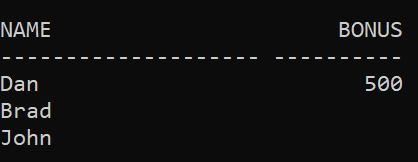

<br><br><br>


# 584. Find Customer Referee

```SQL
SELECT C.NAME NAME
FROM CUSTOMER C
LEFT JOIN CUSTOMER R ON C.REFEREE_ID = R.ID
WHERE R.ID IS NULL OR 
      R.ID != 2;
```
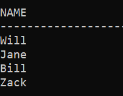

<BR><BR><BR>


# 586. Customer Placing the Largest Number of Orders

```SQL
SELECT CUSTOMER_NUMBER
FROM (SELECT CUSTOMER_NUMBER, COUNT(ORDER_NUMBER) COUNT
      FROM ORDERS
      GROUP BY CUSTOMER_NUMBER
      ORDER BY COUNT DESC)
WHERE ROWNUM = 1;
```
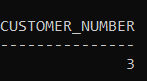

<BR><BR><BR>


# 595. Big Countries

```SQL
SELECT NAME, POPULATION, AREA
FROM WORLD
WHERE POPULATION > 25000000 OR
	   AREA > 6000000;
```
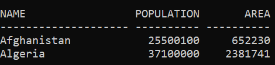

<BR><BR><BR>


# 596. Classes More Than 5 Students

```SQL
SELECT CLASS
FROM COURSES
GROUP BY CLASS
HAVING COUNT(*) >= 5;
```
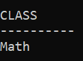

<BR><BR><BR>


# 597. Friend Requests I: Overall Acceptance Rate

```SQL
SELECT 
	ROUND((SELECT COUNT(*) FROM REQUESTACCEPTED) / (SELECT COUNT(*) FROM FRIENDREQUEST), 2) ACCEPT_RATE
FROM DUAL;
```
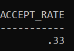

<BR><BR><BR>


# 603 - Consecutive Available Seats

```SQL
SELECT S1.SEAT_ID
  FROM CINEMA S1
  LEFT JOIN CINEMA S2 ON S1.SEAT_ID = S2.SEAT_ID+1
  LEFT JOIN CINEMA S3 ON S1.SEAT_ID = S3.SEAT_ID-1
  WHERE S1.FREE = 1 AND
        (S2.FREE = 1 OR S3.FREE = 1)
  ORDER BY S1.SEAT_ID;
  ```
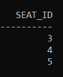

<BR><BR><BR>


# 607 - Sales Person

```SQL
SELECT NAME
FROM SALESPERSON
WHERE SALES_ID NOT IN (SELECT SALES_ID
		       FROM ORDERS
		       WHERE COM_ID IN (SELECT COM_ID 
								FROM COMPANY
								WHERE NAME = 'RED'));
```
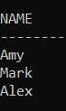

<BR><BR><BR>


# 610. Traingle Judgment

```SQL
SELECT X, Y, Z,
   CASE
      WHEN X+Y>Z
      AND Y+Z>X 
      AND Z+X>Y 
      THEN 'YES'
      ELSE 'NO'
   END AS TRIANGLE
FROM TRIANGLE;
```
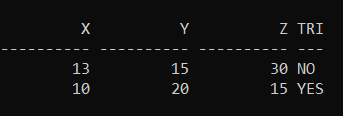

<br><br><br>


# 613 - Shortest distance in a Line

```SQL
SELECT MIN(ABS(P1.X - P2.X)) SHORTEST
	FROM POINT P1
	JOIN POINT P2 ON P1.X != P2.X;
```
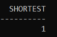

<br><br><br>


# 619 - Biggest Single Number

```SQL
SELECT MAX(NUM) NUM
FROM MYNUMBERS
WHERE NUM LIKE '_';
```
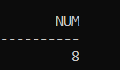

<br><br><br>


# 620 - Not Boring Movies

```SQL
SELECT ID, MOVIE, DESCRIPTION, RATING
FROM CINEMA
WHERE MOD(ID, 2) = 1 AND
      DESCRIPTION != 'Boring'
ORDER BY RATING DESC;
```
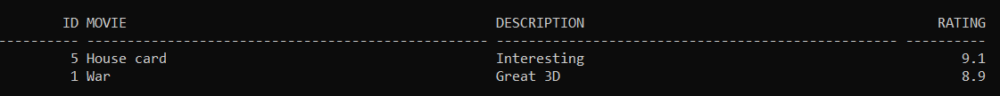

<br><br><br>


# 627 - Swap Sex of Employees

```SQL
UPDATE SALARY
SET SEX = CASE
	      WHEN UPPER(SEX) = 'M' THEN 'F'
  	      WHEN UPPER(SEX) = 'F' THEN 'M'
     	    END;
```
### BEFORE UPDATE
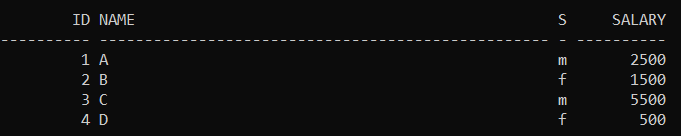

### AFTER UPDATE
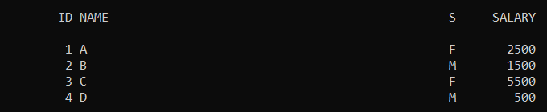

<BR><BR><BR>


# 1050 - Actors and Directors who cooperated atleast 3 times

```SQL
SELECT ACTOR_ID, DIRECTOR_ID
FROM ACTORDIRECTOR
GROUP BY ACTOR_ID, DIRECTOR_ID
HAVING COUNT(*) >= 3;
```
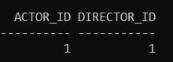

<br><br><br>


# 1068 - Product Sales Analys 1

```SQL
SELECT P.PRODUCT_NAME PRODUCT_NAME, S.YEAR YEAR, SUM(S.PRICE) PRICE
FROM PRODUCT P
JOIN SALES S ON P.PRODUCT_ID = S.PRODUCT_ID
GROUP BY P.PRODUCT_NAME, S.YEAR;
```
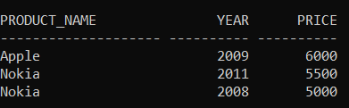

<br><br><br>


# 1069 - Product Sales Analasys 2

```SQL
SELECT PRODUCT_ID, SUM(QUANTITY) TOTAL_QUANTITY
FROM SALES
GROUP BY PRODUCT_ID;
```
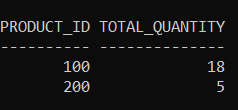

<br><br><br>


# 1075 - Project Employee 1

```SQL
SELECT P.PROJECT_ID PROJECT_ID, ROUND(AVG(E.EXPERIENCE_YEARS), 2) AVERAGE_YEARS
FROM PROJECT P
JOIN EMPLOYEE E ON E.EMPLOYEE_ID = P.EMPLOYEE_ID
GROUP BY P.PROJECT_ID
```
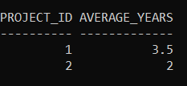

<br><br><br>


# 1076 - PROJECT EMPLOYEE 2

```SQL
SELECT PROJECT_ID
FROM PROJECT
GROUP BY PROJECT_ID
HAVING COUNT(EMPLOYEE_ID) = (SELECT MAX(COUNT)
                             FROM (SELECT PROJECT_ID, COUNT(EMPLOYEE_ID) COUNT
                                    FROM PROJECT
                                    GROUP BY PROJECT_ID))
```
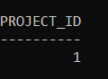

<BR><BR><BR>


# 1082 - Sales Analysis 1

```SQL
SELECT SELLER_ID
FROM SALES
GROUP BY SELLER_ID
HAVING SUM(PRICE) = (SELECT MAX(PRICE)
		         FROM (SELECT SELLER_ID, SUM(PRICE) PRICE
                           FROM SALES
                           GROUP BY SELLER_ID));
```
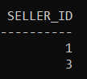

<br><br><br>


# 1083 - Sales Analysys 2

```SQL
SELECT S.BUYER_ID BUYER_ID
FROM SALES S
JOIN PRODUCT P ON P.PRODUCT_ID = S.PRODUCT_ID
GROUP BY S.BUYER_ID
HAVING SUM(CASE WHEN PRODUCT_NAME = 'S8' THEN 1 ELSE 0 END) > 0 AND
	 SUM(CASE WHEN PRODUCT_NAME = 'iPhone' THEN 1 ELSE 0 END) = 0;
```
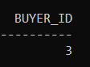

<br><br><br>


